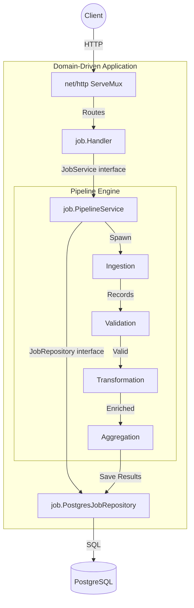

# Data Processor Pipeline

A high-performance, concurrent data ingestion and processing pipeline built in Go.

## Features

- **Concurrent Processing:** Fan-out/Fan-in worker pools using goroutines and channels to process massive datasets.
- **REST API:** Domain-driven architecture using Go's native `net/http` with Go 1.22+ method-based routing.
- **PostgreSQL Database:** Schema versioning with `golang-migrate` and embedded SQL migrations auto-applied on startup.
- **Graceful Shutdown:** Signal-aware server (`SIGINT`/`SIGTERM`) with a 30-second drain window to protect in-flight pipeline jobs.
- **Pure Docker Tooling:** Run tests, linting, Swagger generation, and the full stack without installing Go locally.

## Technology Stack

| Layer | Technology |
|---|---|
| Language | Go 1.23 |
| HTTP Router | `net/http` (stdlib, Go 1.22+ path params) |
| Database | PostgreSQL 16 |
| Migrations | `golang-migrate/migrate` (embedded via `go:embed`) |
| Logging | `log/slog` (stdlib, structured JSON) |
| API Docs | Swagger via `swaggo/swag` |
| Linting | `golangci-lint` (errcheck, govet, staticcheck) |
| Containerisation | Docker multi-stage build + Docker Compose |

## Architecture



### Dependency Flow

All dependencies point **inward** via interfaces — no layer knows about the concrete type above it:

```
main.go → server.RegisterRoutes(svc)
              ↓
         job.Handler (defines JobService interface)
              ↓
         job.PipelineService (defines JobRepository interface)
              ↓
         job.PostgresJobRepository (implements JobRepository)
              ↓
         store.DB (connection pool + migrations)
```

## Project Layout

```
backend/
├── cmd/api/                  Application entry point and config
│   └── main.go
├── internal/                 Private application code (Go import boundary)
│   ├── job/                  Domain package — handler, service, repository co-located
│   │   ├── handler.go        HTTP handlers + JobService interface (consumer-defined)
│   │   ├── service.go        Business logic + JobRepository interface (consumer-defined)
│   │   └── repository.go     PostgreSQL implementation of JobRepository
│   ├── server/               HTTP wiring
│   │   └── routes.go         Route registration, Swagger mount
│   ├── models/               Shared domain types
│   │   └── job.go            Job, JobError, JobResult structs + status constants
│   ├── pipeline/             Concurrent processing engine
│   └── store/                Database connection and migrations
│       ├── db.go             Connection pool setup + auto-migration
│       └── migrations/       Embedded SQL migration files
├── pkg/                      Reusable, importable packages
│   ├── apperrors/            Sentinel errors + AppError struct
│   └── logger/               Structured JSON logger factory
├── docs/                     Auto-generated Swagger documentation
├── Dockerfile                Multi-stage production build
├── .golangci.yml             Linter configuration
└── go.mod / go.sum
```

> This layout follows the [golang-standards/project-layout](https://github.com/golang-standards/project-layout) convention and uses **domain-driven packaging** — each feature area (`job/`) co-locates its handler, service, and repository rather than grouping by technical layer.

## Quick Start

All you need is **Docker** installed.

### 1. Clone and configure

```bash
git clone https://github.com/narayan-mindfire/data-processor.git
cd data-processor
cp .env.example .env          # edit DB_PASSWORD for production
```

### 2. Start the stack

```bash
docker compose up --build
```

This starts PostgreSQL and the API server. Migrations run automatically on boot.

### 3. Verify

```bash
# Health check
curl http://localhost:8080/api/v1/pipelines

# Swagger UI
open http://localhost:8080/api-docs/index.html
```

## API Endpoints

| Method | Path | Description |
|---|---|---|
| `POST` | `/api/v1/pipelines` | Start a new pipeline job |
| `GET` | `/api/v1/pipelines` | List all pipeline jobs |
| `GET` | `/api/v1/pipelines/{id}` | Get job details by ID |
| `GET` | `/api/v1/pipelines/{id}/progress` | Get real-time job progress |
| `GET` | `/api/v1/pipelines/{id}/results` | Get aggregated results |
| `GET` | `/api/v1/pipelines/{id}/errors` | Get error logs for a job |
| `PATCH` | `/api/v1/pipelines/{id}/cancel` | Cancel a running job |
| `DELETE` | `/api/v1/pipelines/{id}` | Delete a job and its artifacts |

## Sample Test Payload

Because this pipeline is heavily concurrent and supports dynamic data-source combinations, you can test its full capabilities using a single request. 

The following payload instructs the pipeline to simultaneously:
1. Fetch 200 CSV records and average their weights.
2. Fetch 100 JSONPlaceholder posts and count their IDs.
3. Fetch a nested `results` array of 10 users from RandomUser API and count their genders.
4. Fetch live Cryptocurrency market data and calculate a massive price sum.
5. Fetch Open-Meteo weather data and parse the top-level object to extract elevation.

You can paste this exact payload directly into the Swagger UI (`http://localhost:8080/swagger/index.html`) under the `POST /api/v1/pipelines` endpoint:

```json
{
  "sources": [
    {
      "type": "csv",
      "url": "https://people.sc.fsu.edu/~jburkardt/data/csv/hw_200.csv"
    },
    {
      "type": "json",
      "url": "https://jsonplaceholder.typicode.com/posts"
    },
    {
      "type": "json",
      "url": "https://randomuser.me/api/?results=10",
      "json_array_path": "results"
    },
    {
      "type": "json",
      "url": "https://api.coingecko.com/api/v3/coins/markets?vs_currency=usd"
    },
    {
      "type": "json",
      "url": "https://api.open-meteo.com/v1/forecast?latitude=20&longitude=85&current_weather=true"
    }
  ],
  "validations": [
    {"field": "Weight(Pounds)", "rule": "not_empty"},
    {"field": "gender", "rule": "not_empty"},
    {"field": "current_price", "rule": "not_empty"},
    {"field": "elevation", "rule": "not_empty"}
  ],
  "transformations": [
    {"field": "Weight(Pounds)", "action": "convert_to_float"},
    {"field": "current_price", "action": "convert_to_float"},
    {"field": "elevation", "action": "convert_to_float"}
  ],
  "aggregations": [
    {"type": "average", "field": "Weight(Pounds)", "output_name": "average_weight"},
    {"type": "count", "field": "id", "output_name": "total_json_posts"},
    {"type": "count", "field": "gender", "output_name": "total_random_users"},
    {"type": "sum", "field": "current_price", "output_name": "sum_crypto_prices"},
    {"type": "sum", "field": "elevation", "output_name": "total_elevation"}
  ],
  "concurrency": {
    "validation_workers": 10,
    "transform_workers": 10
  }
}
```

## Environment Variables

| Variable | Required | Default | Description |
|---|---|---|---|
| `DB_PASSWORD` | **Yes** | — | PostgreSQL password (no default — app panics if unset) |
| `DB_HOST` | No | `localhost` | Database host |
| `DB_PORT` | No | `5432` | Database port |
| `DB_USER` | No | `postgres` | Database user |
| `DB_NAME` | No | `dataprocessor` | Database name |
| `PORT` | No | `8080` | API server port |

## License

This project is private and proprietary.