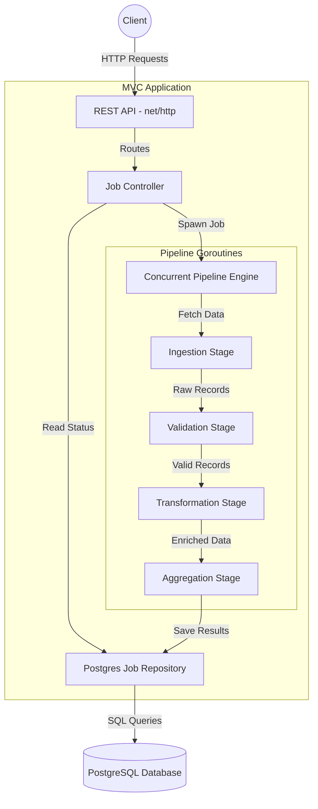

# Data Processor Pipeline

A high-performance, concurrent data ingestion and processing pipeline built in Go.

## Features

- **Concurrent Processing:** Uses Go routines and channels to process massive datasets rapidly (Fan-out/Fan-in worker pools).
- **REST API:** Fully decoupled MVC architecture utilizing Go's native `net/http` routing.
- **PostgreSQL Database:** Professional schema versioning using `golang-migrate/migrate` (auto-applied on startup).
- **Pure Docker Tooling:** Run tests, linting, Swagger generation, and the entire application without installing Go locally.

## Architecture Diagram



## Quick Start

Because we use a Pure Docker philosophy, all you need is Docker installed on your machine.

### 1. Start the Database & API:

```bash
docker compose up --build
```

### 2. View Interactive API Documentation (Swagger)

Open your browser to: `http://localhost:8080/api-docs/index.html`

## Architecture Layout

This project follows strict Package-Oriented Design (MVC-style):

- `cmd/api/` - The entry point and application bootstrapper.
- `internal/api/routes/` - Domain-specific route registration.
- `internal/api/controllers/` - HTTP request parsing, input validation, and response handling.
- `internal/api/repositories/` - Raw SQL execution and database abstractions.
- `internal/models/` - Core domain entities (Job, JobError, JobResult).